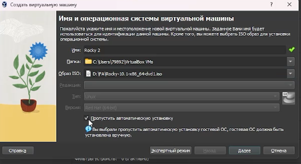
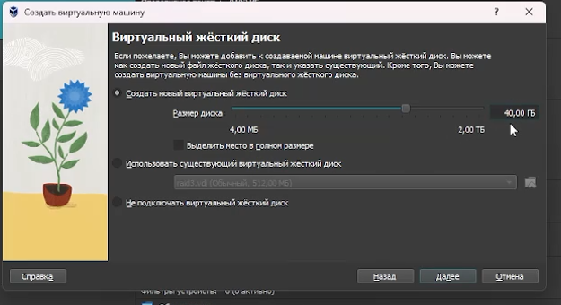
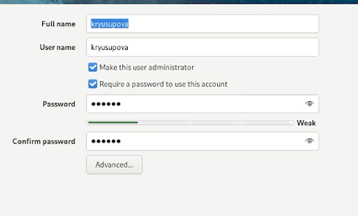

---
## Front matter
lang: ru-RU
title: Лабораторная работа №1
subtitle: Установка и конфигурация операционной системы на виртуальную машину
author:
  - Юсупова К. Р.
institute:
  - Российский университет дружбы народов, Москва, Россия

## i18n babel
babel-lang: russian
babel-otherlangs: english

## Formatting pdf
toc: false
toc-title: Содержание
slide_level: 2
aspectratio: 169
section-titles: true
theme: metropolis
header-includes:
 - \metroset{progressbar=frametitle,sectionpage=progressbar,numbering=fraction}
---

# Информация

## Докладчик

:::::::::::::: {.columns align=center}
::: {.column width="70%"}

  * Юсупова Ксения Равилевна
  * Российский университет дружбы народов
  * Номер студенческого билета- 1132247531
  * [1132247531@pfur.ru]

:::
::::::::::::::

# Вводная часть

## Цель работы

Целью данной работы является приобретение практических навыков установки операционной системы на виртуальную машину, настройки минимально необходимых для дальнейшей работы сервисов.

# Выполнение лабораторной работы

Установили на виртуальную машину VirtualBox операционную системы Linux (дистрибутив Rocky). Создали новую виртуальную машину и указали имя виртуальной машины 

{#fig:001 width=70%}

## Выполнение лабораторной работы

Указали размер основной памяти виртуальной машины 4096
МБ

{#fig:002 width=70%}

## Выполнение лабораторной работы

Задали размер диска — 40 ГБ 

{#fig:003 width=70%}

## Выполнение лабораторной работы

Запустили виртуальную машину, выбрали English в качестве языка интерфейса и перешли к настройкам установки опера-ционной системы. Установили пароль для root и пользователя с правами администратора

{#fig:004 width=60%}

## Выполнение лабораторной работы

В разделе выбора программ указали в качестве базового окружения Server with GUI , а в качестве дополнения — Development Tools. Отключили KDUMP. Место установки ОС оставили без изменения 

{#fig:005 width=60%}

## Выполнение лабораторной работы

Вошли в ОС под заданной нами при установке учётной записью. В меню Устройства виртуальной машины подключили образ диска дополнений гостевой ОС, и ввели пароль пользователя root виртуальной ОС. После загрузки дополнений нажали Return или Enter и корректно перезагрузили виртуальную машину.

{#fig:006 width=70%}

# Домашнее задание

При выполнении домашнего задания мы узнали , что в системе установлена версия ядра 5.14.0-570.17.1.el9_6.x86_64. Тактовая частота процессора составляет 2295.730 МГц (~2.3 ГГц). Установлен процессор AMD Ryzen 7 3700U с интегрированной графикой Radeon Vega Mobile Gfx.

{#fig:007 width=60%}

## Домашнее задание

Также узнали, что доступно 3 620 832 КБ (~3.45 ГБ) оперативной памяти из общего объема 4 193 848 КБ (4 ГБ). Система работает в виртуальной среде, гипервизор — KVM. Корневая файловая система имеет тип XFS (версия V5). Идентификатор корневого раздела: dm-0. На основе полученных данных из буфера сообщений ядра можно восстановить последовательность монтирования: 1) dm-0 — корневой раздел; 2) sda1 — дополнительный раздел

{#fig:008 width=60%}

# Выводы

В ходе лабораторной работы мы приобрели практические навыки установки операционной системы на виртуальную машину, настройки минимально необходимых для дальнейшей работы сервисов.

