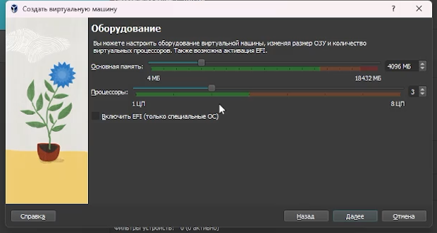
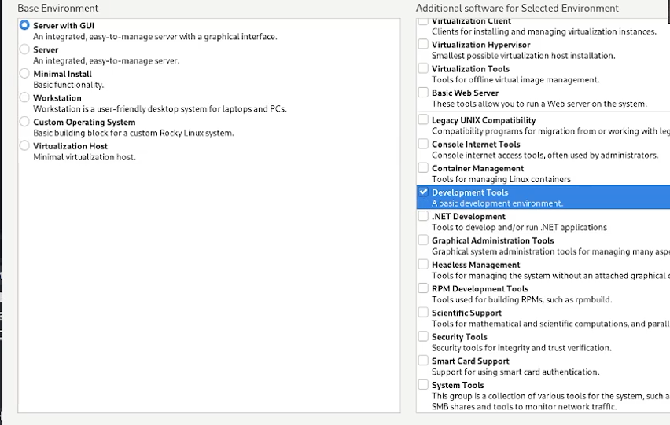
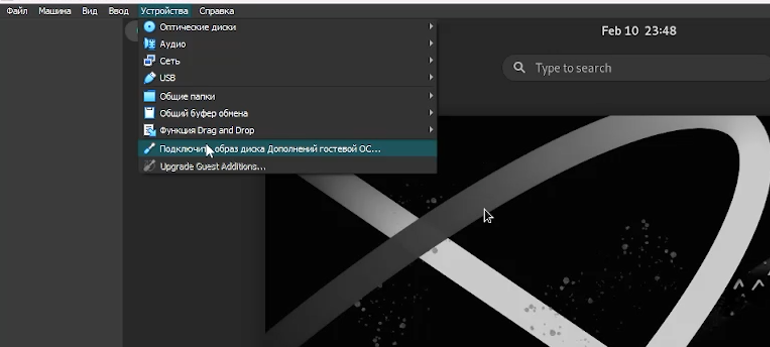
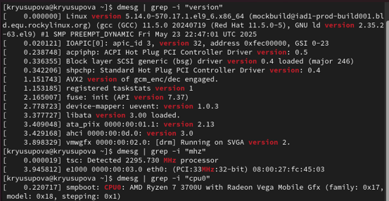
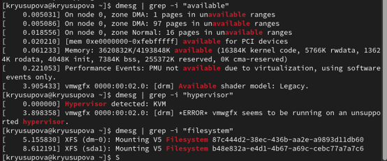

---
## Front matter
title: "Лабораторная работа №1"
subtitle: "Установка и конфигурация операционной системы на виртуальную машину"
author: "Юсупова Ксения Равилевна"

## Generic otions
lang: ru-RU
toc-title: "Содержание"

## Bibliography
bibliography: bib/cite.bib
csl: pandoc/csl/gost-r-7-0-5-2008-numeric.csl

## Pdf output format
toc: true # Table of contents
toc-depth: 2
lof: true # List of figures
lot: true # List of tables
fontsize: 12pt
linestretch: 1.5
papersize: a4
documentclass: scrreprt
## I18n polyglossia
polyglossia-lang:
  name: russian
  options:
	- spelling=modern
	- babelshorthands=true
polyglossia-otherlangs:
  name: english
## I18n babel
babel-lang: russian
babel-otherlangs: english
## Fonts
mainfont: IBM Plex Serif
romanfont: IBM Plex Serif
sansfont: IBM Plex Sans
monofont: IBM Plex Mono
mathfont: STIX Two Math
mainfontoptions: Ligatures=Common,Ligatures=TeX,Scale=0.94
romanfontoptions: Ligatures=Common,Ligatures=TeX,Scale=0.94
sansfontoptions: Ligatures=Common,Ligatures=TeX,Scale=MatchLowercase,Scale=0.94
monofontoptions: Scale=MatchLowercase,Scale=0.94,FakeStretch=0.9
mathfontoptions:
## Biblatex
biblatex: true
biblio-style: "gost-numeric"
biblatexoptions:
  - parentracker=true
  - backend=biber
  - hyperref=auto
  - language=auto
  - autolang=other*
  - citestyle=gost-numeric
## Pandoc-crossref LaTeX customization
figureTitle: "Рис."
tableTitle: "Таблица"
listingTitle: "Листинг"
lofTitle: "Список иллюстраций"
lotTitle: "Список таблиц"
lolTitle: "Листинги"
## Misc options
indent: true
header-includes:
  - \usepackage{indentfirst}
  - \usepackage{float} # keep figures where there are in the text
  - \floatplacement{figure}{H} # keep figures where there are in the text
---

# Цель работы

Целью данной работы является приобретение практических навыков установки операционной системы на виртуальную машину, настройки минимально необходимых для дальнейшей работы сервисов.

# Выполнение лабораторной работы

Установили на виртуальную машину VirtualBox операционную системы Linux (дистрибутив Rocky). Создали новую виртуальную машину и указали имя виртуальной машины  (рис. [-@fig:001]).

{#fig:001 width=70%}

Указали размер основной памяти виртуальной машины 4096
МБ(рис. [-@fig:002]).

{#fig:002 width=70%}

Задали размер диска — 40 ГБ (рис. [-@fig:003]).

{#fig:003 width=70%}

Запустили виртуальную машину, выбрали English в качестве языка интерфейса и перешли к настройкам установки опера-ционной системы. Установили пароль для root и пользователя с правами администратора(рис. [-@fig:004]).

{#fig:004 width=70%}

В разделе выбора программ указали в качестве базового окружения Server with GUI , а в качестве дополнения — Development Tools. Отключили KDUMP. Место установки ОС оставили без изменения ((рис. [-@fig:005]).

{#fig:005 width=70%}

Вошли в ОС под заданной нами при установке учётной записью. В меню Устройства виртуальной машины подключили образ диска дополнений гостевой ОС, и ввели пароль пользователя root виртуальной ОС. После загрузки дополнений нажали Return или Enter и корректно перезагрузили виртуальную машину.(рис. [-@fig:006]).

{#fig:006 width=70%}

# Домашнее задание

При выполнении домашнего задания мы узнали , что в системе установлена версия ядра 5.14.0-570.17.1.el9_6.x86_64. Тактовая частота процессора составляет 2295.730 МГц (~2.3 ГГц). Установлен процессор AMD Ryzen 7 3700U с интегрированной графикой Radeon Vega Mobile Gfx.(рис. [-@fig:007]).

{#fig:007 width=70%}

Также узнали, что доступно 3 620 832 КБ (~3.45 ГБ) оперативной памяти из общего объема 4 193 848 КБ (4 ГБ). Система работает в виртуальной среде, гипервизор — KVM. Корневая файловая система имеет тип XFS (версия V5). Идентификатор корневого раздела: dm-0. На основе полученных данных из буфера сообщений ядра можно восстановить последовательность монтирования: 1) dm-0 — корневой раздел; 2) sda1 — дополнительный раздел(рис. [-@fig:008]).

{#fig:008 width=70%}

# Ответы на контрольные вопосы

1. Учётная запись пользователя в Linux содержит следующую информацию: имя пользователя (login), UID (идентификатор пользователя), GID (идентификатор основной группы), домашний каталог (home directory), командную оболочку (shell), а также пароль (в зашифрованном виде или ссылка на него в файле /etc/shadow), полное имя пользователя (GECOS-поле) и дату действия учётной записи. Вся эта информация хранится в файлах /etc/passwd, /etc/shadow и /etc/group

2. Примеры команд терминала в Rocky Linux: – для получения справки по команде: man ls (руководство по команде ls), ls --help (краткая справка), whatis ls (краткое описание команды); – для перемещения по файловой системе: cd /home (перейти в каталог /home), cd .. (перейти на уровень выше), cd ~ (перейти в домашний каталог); – для просмотра содержимого каталога: ls (список файлов), ls -la (подробный список со скрытыми файлами), tree (древовидная структура); – для определения объёма каталога: du -sh /home (общий размер каталога), du -h --max-depth=1 (размер вложенных папок); – для создания / удаления каталогов / файлов: mkdir newdir (создать каталог), touch file.txt (создать файл), rm file.txt (удалить файл), rm -r dir (удалить каталог), rmdir dir (удалить пустой каталог); – для задания определённых прав на файл / каталог: chmod 755 script.sh (права владелец: чтение/запись/исполнение, группа/остальные: чтение/исполнение), chmod u+x file (добавить исполнение для владельца), chown user:group file (сменить владельца/группу); – для просмотра истории команд: history (список всех введённых команд), !! (повтор последней команды), !123 (выполнить команду под номером 123).

3. Файловая система — это способ организации, хранения и именования данных на носителях информации, определяющий структуру каталогов, механизмы доступа к файлам и метаданные. Примеры: ext4 (журналируемая файловая система, стандарт для Linux, поддерживает тома до 1 ЭБ, файлы до 16 ТБ, обратная совместимость), XFS (высокопроизводительная 64-битная журналируемая ФС, оптимизирована для больших файлов и параллельных операций, используется по умолчанию в Rocky Linux 9.6 для корневого раздела), btrfs (современная ФС со встроенными функциями снапшотов, сжатия и проверки целостности), FAT32 (устаревшая ФС для совместимости с Windows, без журналирования, ограничение на размер файла 4 ГБ), NTFS (стандартная ФС Windows с журналированием и поддержкой прав доступа).

4. Чтобы посмотреть, какие файловые системы подмонтированы в ОС, используются следующие команды: mount (вывод всех смонтированных файловых систем с указанием устройства, точки монтирования, типа ФС и опций), df -h (вывод информации о смонтированных ФС с отображением размера, занятого и свободного места в человеко-читаемом формате), findmnt (древовидное отображение всех точек монтирования), cat /proc/mounts (просмотр текущих монтирований из псевдо-файловой системы ядра). В ходе лабораторной работы было установлено, что корневая файловая система типа XFS смонтирована в /, а дополнительный раздел sda1 также типа XFS.

5. Для удаления зависшего процесса в Linux необходимо: сначала определить PID процесса с помощью команд ps aux | grep имя процесса или top, затем отправить сигнал завершения командой kill PID (по умолчанию отправляется сигнал SIGTERM (15) — запрос на корректное завершение). Если процесс не завершается, используется принудительное завершение: kill -9 PID или kill -SIGKILL PID (сигнал 9, немедленное уничтожение процесса без сохранения данных). Для завершения всех процессов по имени: killall <имя процесса> или pkill <имя процесса> . В случае зависания графического приложения можно использовать xkill и кликнуть по окну мышью.

# Выводы

В ходе лабораторной работы мы приобрели практические навыки установки операционной системы на виртуальную машину, настройки минимально необходимых для дальнейшей работы сервисов.

