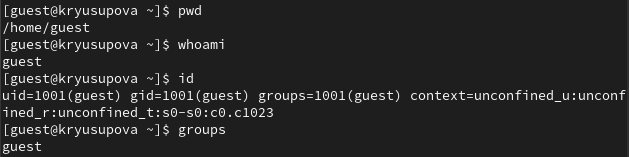
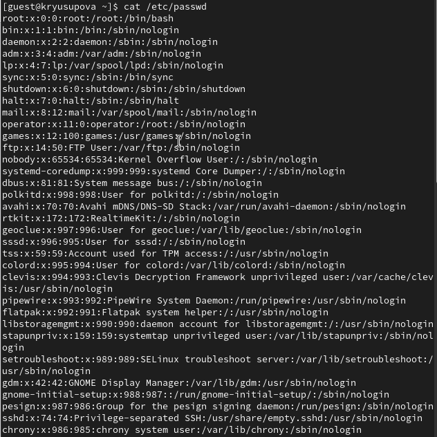
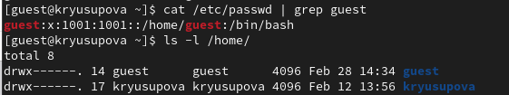
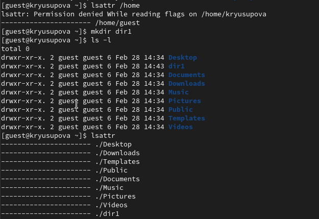
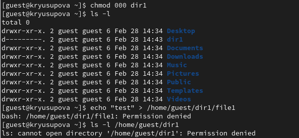

---
## Front matter
lang: ru-RU
title: Лабораторная работа №2
subtitle: Дискреционное разграничение прав в Linux. Основные атрибуты
author:
  - Юсупова К. Р.
institute:
  - Российский университет дружбы народов, Москва, Россия

## i18n babel
babel-lang: russian
babel-otherlangs: english

## Formatting pdf
toc: false
toc-title: Содержание
slide_level: 2
aspectratio: 169
section-titles: true
theme: metropolis
header-includes:
 - \metroset{progressbar=frametitle,sectionpage=progressbar,numbering=fraction}
---

# Информация

## Докладчик

:::::::::::::: {.columns align=center}
::: {.column width="70%"}

  * Юсупова Ксения Равилевна
  * Российский университет дружбы народов
  * Номер студенческого билета- 1132247531
  * [1132247531@pfur.ru]

:::
::::::::::::::

# Вводная часть

## Цель работы

Получение практических навыков работы в консоли с атрибутами файлов, закрепление теоретических основ дискреционного разграничения доступа в современных системах с открытым кодом на базе ОС Linux

# Выполнение лабораторной работы

В установленной при выполнении предыдущей лабораторной работы операционной системе создали учётную запись пользователя guest и задали пароль для пользователя guest

{#fig:001 width=70%}

## Выполнение лабораторной работы

Вошли в систему от имени пользователя guest. Определили директорию, в которой находимся, командой pwd. Определили, является что она является нашей домашней директорией. Уточнили имя пользователя командой whoami и имя пользователя, его группу, а также группы, куда входит пользователь, командой id. Сравнили вывод id с выводом команды groups.

{#fig:002 width=70%}

## Выполнение лабораторной работы

Просмотрели файл /etc/passwd командой, нашли в нём свою учётную запись. Определили uid пользователя.
Определили gid пользователя. Сравнили найденные значения с полученными в предыдущих пунктах.

{#fig:003 width=40%}

## Выполнение лабораторной работы

Определили существующие в системе директории командой
ls -l /home/ . Удалось получить список поддиректорий директории /home. Права на директориях - drwx (700) (полный доступ только для владельца)

{#fig:004 width=60%}

## Выполнение лабораторной работы

Проверили, какие расширенные атрибуты установлены на поддиректориях, находящихся в директории /home, командой: lsattr /home . Удалось увидеть расширенные атрибуты директории для /home/guest/ . Не удалось  увидеть расширенные атрибуты директорий других
пользователей. Создали в домашней директории поддиректорию dir1. Определили командами ls -l и lsattr, права доступа- drwxr-xr-x (владелец guest имеет права на чтение, запись и вполнение) и расширенные атрибуты были выставлены на директорию dir1

{#fig:005 width=50%}

## Выполнение лабораторной работы

Сняли с директории dir1 все атрибуты и проверили с её помощью правильность выполнения команды ls -l . Попытлись создать в директории dir1 файл file1, но получили отказ в выполнении операции по созданию файла из-за отсутствия прав. Файл file1 действительно не находится внутри директории dir1

{#fig:006 width=60%}

## Таблица 2.1

| | | | | | | | | | |
|-|-|-|-|-|-|-|-|-|-|
|Права дир.|Права Ф.|Создание Ф.|Удаление Ф.|Запись Ф. |Чтение Ф.|Смена директории| Просмотр файлов в директории|Переименование ф.|Смена атрибутов ф.|
|000|000|-|-|-|-|-|-|-|-|
|000|100|-|-|-|-|-|-|-|-|
|000|200|-|-|-|-|-|-|-|-|
|000|300|-|-|-|-|-|-|-|-|
|000|400|-|-|-|-|-|-|-|-|
|000|500|-|-|-|-|-|-|-|-|
|000|600|-|-|-|-|-|-|-|-|
|000|700|-|-|-|-|-|-|-|-|
|100|000|-|-|-|-|+|-|-|+|
|100|100|-|-|-|-|+|-|-|+|
|100|200|-|-|+|-|+|-|-|+|
|100|300|-|-|+|-|+|-|-|+|
|100|400|-|-|-|+|+|-|-|+|
|100|500|-|-|-|+|+|-|-|+|
|100|600|-|-|+|+|+|-|-|+|
|100|700|-|-|+|+|+|-|-|+|
|200|000|-|-|-|-|-|-|-|-|
|200|100|-|-|-|-|-|-|-|-|
|200|200|-|-|-|-|-|-|-|-|
|200|300|-|-|-|-|-|-|-|-|
|200|400|-|-|-|-|-|-|-|-|

## Таблица 2.2

| | | |
|-|-|-|
|Операция|Минимальные права директорию|Минимальные права на файл|
|Создание файла|300|-|
|Удаление файла|300|-|
|Чтение файла|100|400|
|Запись в файл|100|200|
|Переименование файла|300|000|
|Создание поддиректории|300|-|
|Удаление поддиректории|300|-|

# Выводы

В ходе выполнения лабораторной работы мы получили практические навыки работы в консоли с атрибутами файлов, закрепление теоретических основ дискреционного разграничения доступа в современных системах с открытым кодом на базе ОС Linux.
