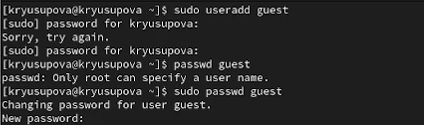

---
## Front matter
title: "Дискреционное разграничение прав в Linux. Основные атрибуты"
subtitle: "Лабораторная работа 2"
author: "Юсупова Ксения Равилевна"

## Generic otions
lang: ru-RU
toc-title: "Содержание"

## Bibliography
bibliography: bib/cite.bib
csl: pandoc/csl/gost-r-7-0-5-2008-numeric.csl

## Pdf output format
toc: true # Table of contents
toc-depth: 2
lof: true # List of figures
lot: true # List of tables
fontsize: 12pt
linestretch: 1.5
papersize: a4
documentclass: scrreprt
## I18n polyglossia
polyglossia-lang:
  name: russian
  options:
	- spelling=modern
	- babelshorthands=true
polyglossia-otherlangs:
  name: english
## I18n babel
babel-lang: russian
babel-otherlangs: english
## Fonts
mainfont: IBM Plex Serif
romanfont: IBM Plex Serif
sansfont: IBM Plex Sans
monofont: IBM Plex Mono
mathfont: STIX Two Math
mainfontoptions: Ligatures=Common,Ligatures=TeX,Scale=0.94
romanfontoptions: Ligatures=Common,Ligatures=TeX,Scale=0.94
sansfontoptions: Ligatures=Common,Ligatures=TeX,Scale=MatchLowercase,Scale=0.94
monofontoptions: Scale=MatchLowercase,Scale=0.94,FakeStretch=0.9
mathfontoptions:
## Biblatex
biblatex: true
biblio-style: "gost-numeric"
biblatexoptions:
  - parentracker=true
  - backend=biber
  - hyperref=auto
  - language=auto
  - autolang=other*
  - citestyle=gost-numeric
## Pandoc-crossref LaTeX customization
figureTitle: "Рис."
tableTitle: "Таблица"
listingTitle: "Листинг"
lofTitle: "Список иллюстраций"
lotTitle: "Список таблиц"
lolTitle: "Листинги"
## Misc options
indent: true
header-includes:
  - \usepackage{indentfirst}
  - \usepackage{float} # keep figures where there are in the text
  - \floatplacement{figure}{H} # keep figures where there are in the text
---

# Цель работы

Получение практических навыков работы в консоли с атрибутами файлов, закрепление теоретических основ дискреционного разграничения доступа в современных системах с открытым кодом на базе ОС Linux

# Выполнение лабораторной работы

В установленной при выполнении предыдущей лабораторной работы операционной системе создали учётную запись пользователя guest и задали пароль для пользователя guest(([рис. @fig:001]).

{#fig:001}

Вошли в систему от имени пользователя guest. Определили директорию, в которой находимся, командой pwd. Определили, является что она является нашей домашней директорией. Уточнили имя пользователя командой whoami и имя пользователя, его группу, а также группы, куда входит пользователь, командой id. Сравнили вывод id с выводом команды groups.([рис. @fig:002]).

{#fig:002}

Просмотрели файл /etc/passwd командой, нашли в нём свою учётную запись. Определили uid пользователя.
Определили gid пользователя. Сравнили найденные значения с полученными в предыдущих пунктах.([рис. @fig:003]).

{#fig:003}

Определили существующие в системе директории командой
ls -l /home/ . Удалось получить список поддиректорий директории /home. Права на директориях - drwx (700) (полный доступ только для владельца)([рис. @fig:004]).

{#fig:004}

Проверили, какие расширенные атрибуты установлены на поддиректориях, находящихся в директории /home, командой: lsattr /home . Удалось увидеть расширенные атрибуты директории для /home/guest/ . Не удалось  увидеть расширенные атрибуты директорий других
пользователей. Создали в домашней директории поддиректорию dir1. Определили командами ls -l и lsattr, права доступа- drwxr-xr-x (владелец guest имеет права на чтение, запись и вполнение) и расширенные атрибуты были выставлены на директорию dir1 ([рис. @fig:005]).

{#fig:005}

Сняли с директории dir1 все атрибуты и проверили с её помощью правильность выполнения команды ls -l . Попытлись создать в директории dir1 файл file1, но получили отказ в выполнении операции по созданию файла из-за отсутствия прав. Файл file1 действительно не находится внутри директории dir1([рис. @fig:006]).

{#fig:006}

## Таблица 2.1

| | | | | | | | | | |
|-|-|-|-|-|-|-|-|-|-|
|Права дир.|Права Ф.|Создание Ф.|Удаление Ф.|Запись Ф. |Чтение Ф.|Смена директории| Просмотр файлов в директории|Переименование ф.|Смена атрибутов ф.|
|000|000|-|-|-|-|-|-|-|-|
|000|100|-|-|-|-|-|-|-|-|
|000|200|-|-|-|-|-|-|-|-|
|000|300|-|-|-|-|-|-|-|-|
|000|400|-|-|-|-|-|-|-|-|
|000|500|-|-|-|-|-|-|-|-|
|000|600|-|-|-|-|-|-|-|-|
|000|700|-|-|-|-|-|-|-|-|
|100|000|-|-|-|-|+|-|-|+|
|100|100|-|-|-|-|+|-|-|+|
|100|200|-|-|+|-|+|-|-|+|
|100|300|-|-|+|-|+|-|-|+|
|100|400|-|-|-|+|+|-|-|+|
|100|500|-|-|-|+|+|-|-|+|
|100|600|-|-|+|+|+|-|-|+|
|100|700|-|-|+|+|+|-|-|+|
|200|000|-|-|-|-|-|-|-|-|
|200|100|-|-|-|-|-|-|-|-|
|200|200|-|-|-|-|-|-|-|-|
|200|300|-|-|-|-|-|-|-|-|
|200|400|-|-|-|-|-|-|-|-|
|200|500|-|-|-|-|-|-|-|-|
|200|600|-|-|-|-|-|-|-|-|
|200|700|-|-|-|-|-|-|-|-|
|300|000|+|+|-|-|+|-|+|+|
|300|100|+|+|-|-|+|-|+|+|
|300|200|+|+|+|-|+|-|+|+|
|300|300|+|+|+|-|+|-|+|+|
|300|400|+|+|-|+|+|-|+|+|
|300|500|+|+|-|+|+|-|+|+|
|300|600|+|+|+|+|+|-|+|+|
|300|700|+|+|+|+|+|-|+|+|
|400|000|-|-|-|-|-|+|-|-|
|400|100|-|-|-|-|-|+|-|-|
|400|200|-|-|-|-|-|+|-|-|
|400|300|-|-|-|-|-|+|-|-|
|400|400|-|-|-|-|-|+|-|-|
|400|500|-|-|-|-|-|+|-|-|
|400|600|-|-|-|-|-|+|-|-|
|400|700|-|-|-|-|-|+|-|-|
|500|000|-|-|-|-|+|+|-|+|
|500|100|-|-|-|-|+|+|-|+|
|500|200|-|-|+|-|+|+|-|+|
|500|300|-|-|+|-|+|+|-|+|
|500|400|-|-|-|+|+|+|-|+|
|500|500|-|-|-|+|+|+|-|+|
|500|600|-|-|+|+|+|+|-|+|
|500|700|-|-|+|+|+|+|-|+|
|600|000|-|-|-|-|-|+|-|-|
|600|100|-|-|-|-|-|+|-|-|
|600|200|-|-|-|-|-|+|-|-|
|600|300|-|-|-|-|-|+|-|-|
|600|400|-|-|-|-|-|+|-|-|
|600|500|-|-|-|-|-|+|-|-|
|600|600|-|-|-|-|-|+|-|-|
|600|700|-|-|-|-|-|+|-|-|
|700|000|+|+|-|-|+|+|+|+|
|700|100|+|+|-|-|+|+|+|+|
|700|200|+|+|+|-|+|+|+|+|
|700|300|+|+|+|-|+|+|+|+|
|700|400|+|+|-|+|+|+|+|+|
|700|500|+|+|-|+|+|+|+|+|
|700|600|+|+|+|+|+|+|+|+|
|700|700|+|+|+|+|+|+|+|+|

## Таблица 2.2

| | | |
|-|-|-|
|Операция|Минимальные права директорию|Минимальные права на файл|
|Создание файла|300|-|
|Удаление файла|300|-|
|Чтение файла|100|400|
|Запись в файл|100|200|
|Переименование файла|300|000|
|Создание поддиректории|300|-|
|Удаление поддиректории|300|-|

# Выводы

В ходе выполнения лабораторной работы мы получили практические навыки работы в консоли с атрибутами файлов, закрепление теоретических основ дискреционного разграничения доступа в современных системах с открытым кодом на базе ОС Linux.

