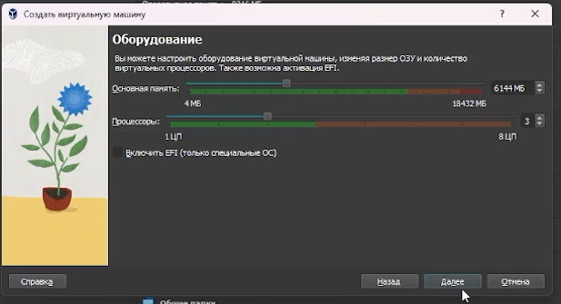
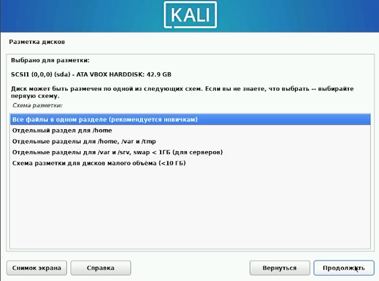
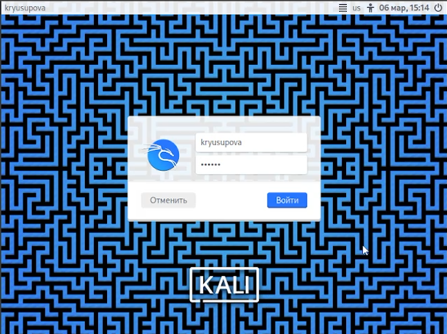

---
## Front matter
lang: ru-RU
title: Выполнение индивидуального проекта 
subtitle: Часть №1
author:
  - Юсупова К. Р.
institute:
  - Российский университет дружбы народов, Москва, Россия

## i18n babel
babel-lang: russian
babel-otherlangs: english

## Formatting pdf
toc: false
toc-title: Содержание
slide_level: 2
aspectratio: 169
section-titles: true
theme: metropolis
header-includes:
 - \metroset{progressbar=frametitle,sectionpage=progressbar,numbering=fraction}
---

# Информация

## Докладчик

:::::::::::::: {.columns align=center}
::: {.column width="70%"}

  * Юсупова Ксения Равилевна
  * Российский университет дружбы народов
  * Номер студенческого билета- 1132247531
  * [1132247531@pfur.ru]

:::
::::::::::::::

# Вводная часть

## Цели и задачи

Получение практических навыков установки операционной системы Kali Linux в среду виртуализации Virtual Box и её первичная настройка

# Выполнение индивидуального пректа

Перешли к созданию виртуальной машины. Указали имя и операционную систему 

{#fig:001 width=70%}

## # Выполнение индивидуального пректа

Выделили объём основноё памяти 6144 Мб и 3 процессора 

{#fig:002 width=70%}

## Выполнение индивидуального пректа

Выбрали русский язык для установки виртульной машины 

{#fig:003 width=60%}

## Выполнение индивидуального пректа

На этапе настройки сети было задано имя компьютера в соответствии с именем пользователя

{#fig:004 width=60%}

## Выполнение индивидуального пректа

Поскольку виртуальный диск чистый, была выбрана автоматическая разметка диска

{#fig:005 width=60%}

## Выполнение индивидуального пректа

После установки операционной системы мы смогли спешно зайти в новую виртуальную машину

{#fig:006 width=50%}

# Выводы

В ходе выполнения индивидуального пректа мы получили практические навыки установки операционной системы Kali Linux в среду виртуализации Virtual Box и выполнили её первичную  настройку.

